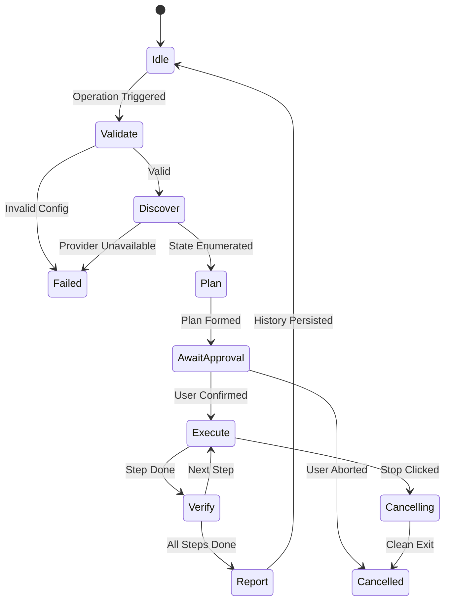

# Operation State Machine & Lifecycle Specification

## 1. Overview

The **Virtual Desktop Workspace Manager** operates under a formalized, verifiable finite state machine. To guarantee predictability, prevent race conditions, and preserve host Windows integrity, workspace executions follow strict state transition rules.

---

## 2. Application States

Conforming to Section 37 of the product specification, the application defines 17 explicit states:

| State | Description | Permitted Transitions |
|---|---|---|
| `UNINITIALIZED` | Application is loading configuration and initializing providers. | `SETUP_REQUIRED`, `READY`, `UNAVAILABLE` |
| `SETUP_REQUIRED` | First-run detected or configuration missing; setup wizard needed. | `READY`, `UNINITIALIZED` |
| `READY` | Configuration is valid, providers connected, and system is idle. | `CONFIGURATION_DIRTY`, `PLANNING`, `DRY_RUN`, `RUNNING` |
| `CONFIGURATION_DIRTY` | User has modified workspace configuration without saving. | `READY`, `VALIDATION_FAILED` |
| `VALIDATION_FAILED` | Configuration schema or semantics failed validation checks. | `CONFIGURATION_DIRTY`, `READY` |
| `DRY_RUN` | Simulating execution and building read-only preview. | `READY` |
| `PLANNING` | Building discrete execution plan steps for target profile. | `AWAITING_CONFIRMATION`, `RUNNING`, `FAILED` |
| `AWAITING_CONFIRMATION` | User approval dialog is displayed for state-altering actions. | `RUNNING`, `CANCELLED` |
| `RUNNING` | Executor is actively launching apps and placing windows. | `PAUSED`, `CANCELLING`, `COMPLETED`, `COMPLETED_WITH_WARNINGS`, `FAILED` |
| `PAUSED` | Automation temporarily paused by user toggle. | `READY`, `RUNNING` |
| `CANCELLING` | User triggered Emergency STOP; cooperative cancellation in flight. | `CANCELLED` |
| `CANCELLED` | Execution stopped safely without killing processes. | `READY` |
| `COMPLETED` | Execution finished with 100% verified window placements. | `READY` |
| `COMPLETED_WITH_WARNINGS` | Execution completed, but non-blocking warnings occurred (e.g., missing app). | `READY` |
| `FAILED` | Fatal error occurred during execution. | `RECOVERY_REQUIRED`, `READY` |
| `RECOVERY_REQUIRED` | Crash marker detected from previous unclean shutdown. | `READY` |
| `UNAVAILABLE` | Host platform lacks required Windows APIs or COM is broken. | `UNINITIALIZED` |

---

## 3. Operation Lifecycle Pipeline

Every workspace operation (`Launch` or `Sync`) executes through an 8-phase pipeline (Section 38):

### Phase Details

1. **Phase 1: Validate**
   - Validates configuration against schema rules (`ConfigValidator`).
   - Ensures target desktops are properly numbered.
2. **Phase 2: Discover**
   - Detects available Windows Virtual Desktops.
   - Detects active processes and usable top-level windows.
3. **Phase 3: Plan**
   - Formulates an immutable `WorkspaceExecutionPlan`.
   - Identifies apps that are already running vs apps requiring launch.
   - Computes target desktop assignments.
4. **Phase 4: Await Approval**
   - If confirmation policy is enabled, presents confirmation dialog.
5. **Phase 5: Execute**
   - Sets persistent crash marker file `operation_in_progress.marker`.
   - Creates missing Virtual Desktops if supported.
   - Launches missing applications with configured delays.
   - Moves matched top-level windows to target desktops.
6. **Phase 6: Verify**
   - Queries `is_window_on_desktop` to verify placement.
   - Records verification status in `AppExecutionStatus`.
7. **Phase 7: Report**
   - Computes elapsed duration, created desktops count, and moved windows count.
   - Generates summary report.
8. **Phase 8: Persist**
   - Appends `OperationHistoryRecord` to `history.json`.
   - Clears `operation_in_progress.marker`.

---

## 4. Crash Recovery Protocol

To ensure fault tolerance and recovery after power loss or abrupt termination (Section 46):

1. **Marker Creation:** When an operation enters `RUNNING`, an atomic marker file (`operation_in_progress.marker`) is written containing the operation name and start timestamp.
2. **Marker Clearing:** Upon graceful completion or clean cancellation, the marker is unlinked.
3. **Recovery Detection:** On next application startup, if the marker exists:
   - State transitions to `RECOVERY_REQUIRED`.
   - A prompt alerts the user that a previous operation may have been interrupted.
   - Offers an immediate `Sync Workspace` action to reconcile window state.
   - Clears the marker.
